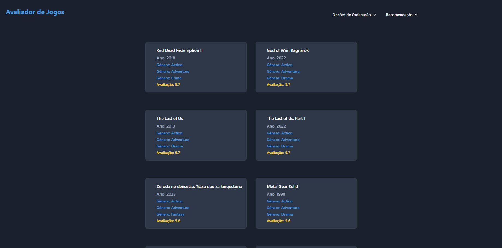
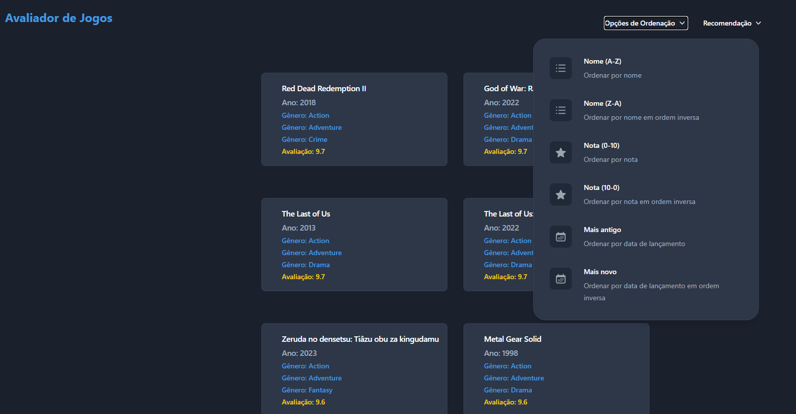
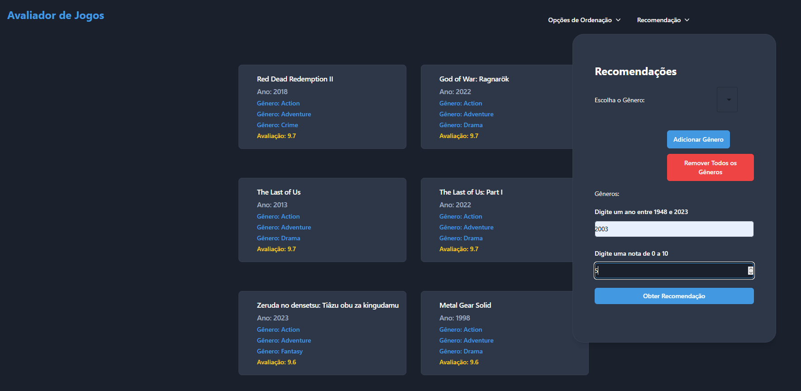

# Dividir-E-Conquistar-Dupla34

Temas:
 - Divisão e Conquista

**Número da Lista**: x<br>
**Conteúdo da Disciplina**: Divisão e Conquista<br>

## Alunos
|Matrícula | Aluno |
| -- | -- |
| 20/2045769  |  Gabriel Saraiva Canabrava|
| 19/0087188  |  Fillipe Souto de Andrade |

## Sobre 

Este projeto é uma aplicação web interativa para ranking e descoberta de jogos, desenvolvida como parte da disciplina de Algoritmos e Estruturas de Dados. A aplicação utiliza algoritmos de divisão e conquista para recomendar jogos baseados nas preferências do usuário.

### Objetivo
O projeto tem como objetivo facilitar a descoberta de novos jogos através de um sistema de recomendação inteligente, demonstrando a aplicação prática de algoritmos de divisão e conquista (merge sort e contagem de inversões) em problemas reais de recomendação e ordenação.

### Tecnologias Utilizadas
- **Algoritmo Merge Sort**: Implementado para ordenação eficiente de jogos usando divisão e conquista
- **Algoritmo de Contagem de Inversões**: Utilizado para calcular a similaridade entre preferências do usuário e características dos jogos
- **React**: Framework JavaScript para desenvolvimento web
- **JavaScript**: Linguagem de programação

### Funcionalidades
- Sistema de recomendação de jogos baseado em preferências (gêneros, ano de lançamento, avaliação)
- Ordenação de jogos usando merge sort
- Interface moderna e responsiva para navegação e busca
- Cálculo automático de similaridade através de contagem de inversões

## Screenshots







## Instalação 

### Pré-requisitos
- Node.js (versão 18 ou superior)
- npm ou yarn

### Tecnologias
- **Linguagem**: JavaScript
- **Framework**: React

### Passos para instalação

1. Instale as dependências:
```bash
npm install
```

2. Execute o projeto em modo de desenvolvimento:
```bash
npm start
```

3. Acesse a aplicação no navegador:
```
http://localhost:3000
```

## Videos

https://unbbr-my.sharepoint.com/:v:/g/personal/202045769_aluno_unb_br/EbV0mgcLz1ZMus6QryZVHm8BV71D_wswJ3wD_DpLu3-EUw?e=wesRFg&nav=eyJyZWZlcnJhbEluZm8iOnsicmVmZXJyYWxBcHAiOiJTdHJlYW1XZWJBcHAiLCJyZWZlcnJhbFZpZXciOiJTaGFyZURpYWxvZy1MaW5rIiwicmVmZXJyYWxBcHBQbGF0Zm9ybSI6IldlYiIsInJlZmVycmFsTW9kZSI6InZpZXcifX0%3D
